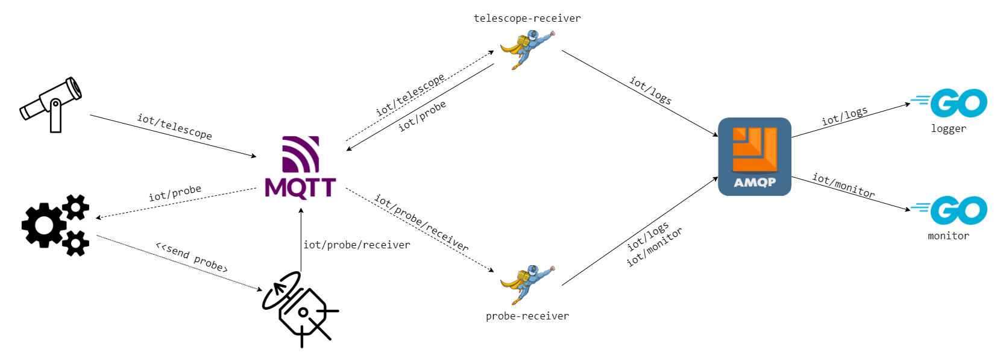

<p align="center">
  
</p>
<br/>
*Nowadays space exploration is limited by technology and physics. Imagine finding yourself in a future where space travel is much easier. The goal of this project is to exploit serverless computing in order to find potentially habitable planets. A telescope will be in charge of spotting planets with characteristics similar to those of the earth, meanwhile a probe will be sent on that planet to obtain more accurate informations.*

-----

# Summary

[> Introduction](#Introduction)\
[> Architecture](#Architecture)\
[> Project structure](#Project-structure)\
[> Getting started](#Getting-started)

# Introduction

This project has been realized for the Serverless Computing for IoT class at "Università degli Studi di Salerno".

ProbeX takes place in a future in which interstellar travels are possible. The goal of the project is to discover potentially habitable planets exploiting the Serverless computing.

In the following sections will be explained how to achive the goal, which are the main technologies involved in this project and will be discussed all the solution design decisions.

# Architecture



ProbeX uses MQTT and AMQP to keep in comunication all involved devices.

The project structure is composed by two main devices: the telescope, and the probe dock, each with a custom MQTT topic on which send messages.
When the Telescope finds a new planet, it sends a message on the MQTT topic *iot/telescope*. The handler *telescope-receiver* catch all telescope messages and finds out if the planet respects the habitability characteristics of the planet using a classifier (the current implementation of the classifier is just a mock).

Whenever the classifier returns as answer YES, the *telescope-receiver* sends a message on the topic *iot/probe*.

The probe dock catches that message and sends a probe on that planet. Each probe will communicate with ProbeX with the MQTT topic *iot/probe/receiver*.

An handler called *probe-receiver* will gain those informations on that topic, updating the *Monitor* status with all new informations catched by the probe.

Eather *telescope-receiver* or *probe-receiver* are implemented on *Nuclio*.

### QoS and Protocols

In this section will be explained all choises regarding the protocol choosed for each device, and the corrispective QoS (Quality of Service).

* **Telescope**: Since a Telescope is a powerful IoT device, the QoS is 2. Thats why it needs a reliable communication with the probe dock, otherwise more than one probe will be sent on the same planet.
* **Probe**: A probe will start to send information when it will arrive on the planet. The probe sends continous information, so we just need to guarantee that at least one message will arrive on our planet. That's why we just need QoS 1.
* **Monitor and Logger**: The monitor and the logger will communicate directly with the AMQP protocol. Thats why a dedicated computer will be used as monitor and logger.

# Project Structure

- **devices**: contains the implementation of the simultated devices;
  - *probe.go*: the simulation device for the Probe Dock;
  - *telescope.go*: the simulation device for the Telescope;
- **probe**: defines the behaviour of **probe-receiver**;
  - *constants.go*: defines constants for the **probe-receiver**;
  - *consumer.go*: in this file is specified the function that will be executed on nuclio;
  - *logger.go*: contains all the utilities for logging on AMQP;
  - *persistence.go*: this file defines the communication of the probe-receiver with the monitor;
  - *function.yaml*: contains all the deploying informations of the function on nuclio;
- **telescope**: defines the behaviour of **telescope-receiver**;
  - *constants.go*: defines constants for the **probe-receiver**;
  - *consumer.go*: in this file is specified the function that will be executed on nuclio;
  - *logger.go*: contains all the utilities for logging on AMQP;
  - *classificator.go*: the mock classificator is defined in this file;
  - *function.yaml*: contains all the deploying informations of the function on nuclio;
- **monitor**: contains the implementation of the AMQP monitor;
- **logging**: contains the implementation of the AMQP logger;
- **.env**: contains the environment variables;

# Getting Started

### Docker
Install [Docker](https://www.docker.com) using the Docker CE installation [guide](https://docs.docker.com/install/linux/docker-ce/ubuntu/#extra-steps-for-aufs).

```sh
$ sudo apt-get update
$ sudo apt-get install \
    apt-transport-https \
    ca-certificates \
    curl \
    gnupg \
    lsb-release
$ curl -fsSL https://download.docker.com/linux/ubuntu/gpg | sudo gpg --dearmor -o /usr/share/keyrings/docker-archive-keyring.gpg
$ echo \
  "deb [arch=amd64 signed-by=/usr/share/keyrings/docker-archive-keyring.gpg] https://download.docker.com/linux/ubuntu \
  $(lsb_release -cs) stable" | sudo tee /etc/apt/sources.list.d/docker.list > /dev/null
$ sudo apt-get update
$ sudo apt-get install docker-ce
```

------------------------------------------------------------------------------------------------------------------------------

### Docker Compose

Install Docker Compose using the Docker Compose installation [guide](https://docs.docker.com/compose/install/#install-compose).

```sh
$ sudo curl -L "https://github.com/docker/compose/releases/download/1.22.0/docker-compose-$(uname -s)-$(uname -m)" -o /usr/local/bin/docker-compose
$ sudo chmod +x /usr/local/bin/docker-compose
```

----------------------------------------------------------------------------------------------------------------------------


### Nuclio 
Start [Nuclio](https://github.com/nuclio/nuclio) using a docker container.

```sh
$ docker run -p 8070:8070 -v /var/run/docker.sock:/var/run/docker.sock -v /tmp:/tmp nuclio/dashboard:stable-amd64
```

Browse to http://localhost:8070.

----------------------------------------------------------------------------------------------------------------------------

### RabbitMQ 

Start [RabbitMQ](https://www.rabbitmq.com) instance with MQTT enabled using docker.

```sh
$ docker run -p 9000:15672  -p 1883:1883 -p 5672:5672  cyrilix/rabbitmq-mqtt 
```

Browse to http://localhost:9000. The default username is ***guest***, and the password is ***guest***

------------------------------------------------------------------------------------------------------------------------------
### Go
The project core is realized in go, then that is how to install it: <br>
Download [Go](https://golang.org/dl/), and follow the installation informations.

### Parameters
In each files replace this strings with you valid parameter
* ***MQTT_USERNAME*** the username to log-in on RabbitMQ
* ***MQTT_PASSWORD*** the password to log-in on RabbitMQ
* ***MQTT_BROKER_IP*** the ip address of the broker RabbitMQ
* ***PORT_ENVP*** the TCP port of the broker RabbitMQ

***⚠️:*** files you have to modity are `.env` file and all `.yaml` files

------------------------------------------------------------------------------------------------------------------------------

### Update and deploy Functions:
- Type '**localhost:8070**' on your browser to open the homepage of Nuclio
- Create new project
- Press '**Create function**', '**Import**' and upload the two functions that are in the **yaml_functions** folder
- In both, **change the already present [parameters](#parameters) with yours**
- Press **'Deploy'**.
